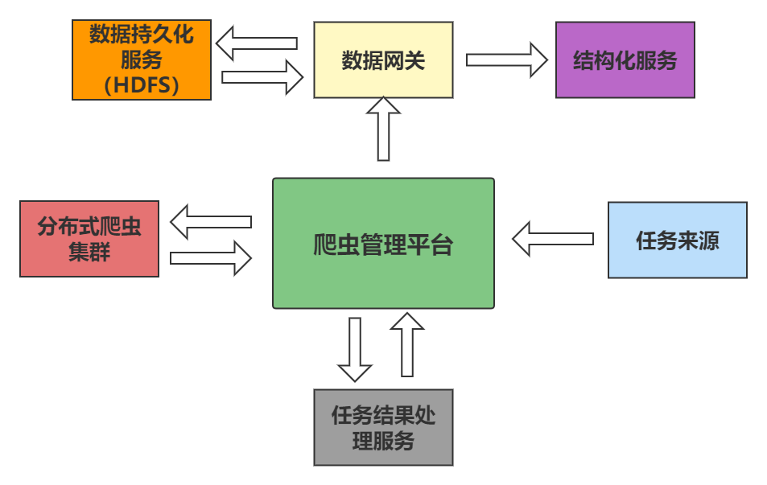
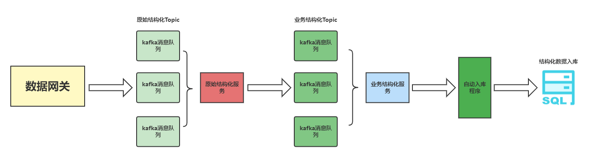

# **Spider-Framework**

## 简介
**spider-framework是一款分布式通用爬虫框架，抽象爬虫抓取模式、任务接口和结构化模式，定义统一的接口规范，是一款将数据抓取与数据结构化解耦的爬虫框架**

## 爬虫端架构图

## 结构化架构图

## 环境要求

- Python 3.6+
- Works on Linux, Windows, macOS, BSD

## 框架特点

#### 1.爬虫功能解耦
抽象爬虫抓取模式、任务接口和结构化模式，定义统一的接口规范，实现爬虫策略的数据抓取与数据结构化解耦；将原始数据持久化，备份数据。

#### 2. 爬虫基础功能服务化
以服务和接口形式供不同爬虫策略调用（如爬虫策略代理服务、爬虫任务消重服务、爬虫原始数据存储服务、爬虫策略监控告警服务和业务结构化数据统一入库服务等）

#### 3. 爬虫策略的绝对控制
实现对爬虫任务粒度级别控制，能够实时控制爬虫策略启停，切换爬虫基础服务；调整爬虫抓取策略和策略优先级，如策略及策略任务类型分布的集群、爬虫策略的运行参数等。

#### 4. 爬虫策略监控与告警
爬虫策略任务的全链路跟踪，标记任务状态、执行时间和处理结果等，通过爬虫策略监控告服务，及时发现问题策略，进行溯源定位，对爬虫策略运行情况可视化分析

